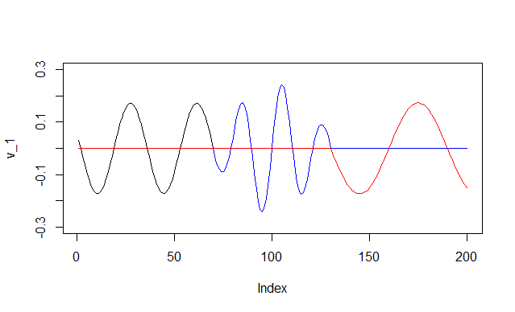

# MoMA test solution
Original problem can be founcd [here](https://github.com/rstats-gsoc/gsoc2018/wiki/MoMA%3A-Modern-Multivariate-Analysis-in-R).

-Implement the SFPCA algorithm for a rank-one approximation in C++ for the special case of L1 ("lasso") penalization on both the left and right singular vectors and user defined smoothing matrices; (see [40] for details of the algorithm) __FINISHED!__

-Wrap their implementation using Rcpp; __FINISHED__

-Test their implementation using `testthat`; **FINISHED**

-Package their implementation and pass `R CMD check` on at least two of the three major platforms: Windows, MacOS, and Linux (Debian/Ubuntu). **FINISHED**

# 1 Introduction

This repo implements the Rank-one SFPCA in _Sparse and Functional Principal Components Analysis, Genevera I. Allen, 2013_. The challenge of proposing SFPCA lies in that 

1) the model needs to take into account sparsity and smoothness of the principal components (PC), and 

2) the optimization problem should enjoy appropriate numerical property. 

In SFPCA algorithm, the original problem is divided into iterating solving penalized regression problem, which can be solved using proximal gradient methods or accelerated proximal gradient method.


# 2 Demo of SFPCA
Details of the two demostrations can be found in `SFPCA demo.R`.

## 2.1 Dataset description

I follow the same setting in the Section 5.1 in the paper. The entire signal is composed of three sparse and smooth signals:

1 A sinusoidal signal at the beginning;

2 A Gaussian-modulated sinusoidal signal in the middle;

3 A sinusoidal signal at the end.


```r
# Sinusoidal
v_1 <- sin((ind+15)*pi/17);v_1[floor(7/20*n):n]=0;v_1 <- v_1/norm_vec(v_1);

# Gaussian-modulated sinusoidal
v_2 <- as.vector(exp(-(ind-100)^2/650)*sin((ind-100)*2*pi/21)); 
v_2[0:floor(7/20*n)]=0; v_2[floor(130/200*n):n] = 0;
v_2 <- v_2/norm_vec(v_2);

# Sinusoidal
v_3 <- sin((ind-40)*pi/30);v_3[0:floor(130/200*n)]=0;v_3 <- v_3/norm_vec(v_3);

plot(v_1,type = 'l',ylim=c(-0.3,0.3));
lines(v_2,col='blue');
lines(v_3,col='red')
```


## 2.2 The effect of penalty parameters

I use a simple nested loop to see how the algorithm behaves in recovering signal. Smooth and sparse penalty on both u and v are set equal. Smooth penalty level ranges in 0.1, 1, 10, 50 and sparse penalty lever in1,3,5,7.

```r
sm_set = c(0.1,1,10)
sp_set = c(1,3,5,7)
par(mfrow=c(length(sm_set),length(sp_set)))
for(sm in sm_set){
  for(sp in sp_set){
    res <- sfpca(X,
                  O_u,O_v,
                  sm,sm,
                  lambda_u=sp,lambda_v=sp,
                  "l1","l1",
                  1e-9,1e+5)
    plot(res$v,type='l',xlab='',ylab='')  
  }
}
mtext("Sparsity ->", side = 3, line = -32, outer = TRUE)	
```


From top to bottom, we can see the connecting part of signal _v1_ and _v2_ becomes more smooth and round, because smooth penalty is becoming more significant. From left to right, remaining signal from _v2_ weakens, meanwhile the major part of _v1_ is also distorted.

## 2.3 Signal recovering
The part try to re-implement Section 5.1 in the paper. The major idea is that, $X = d_1u_1v_1^T + d_2u_2v_2^T + \epsilon$, where $v_1$ and $v_2$ are sinusoidal data, and we try to recover them from the noised matrix. Here I only try to recover fist signal from a combination of 1 and 2.

```r
# Run the model
# Input:
# ---- X: data matrix
# ---- O_u, O_v: Squared second difference matrix
# ---- lambda_u and lambda_v control the penalty level
# ---- "l1", "l1": proximal operator has closed form solution of L1.
# Output:
# ---- u,v: the PCs
# ---- d: u^T X v
# ---- Xhat: deflated X
res1 <- sfpca(X,
              O_u,O_v,
              0.1,0.1,
              lambda_u=5,lambda_v=5,
              "l1","l1",
              1e-9,1e+5)
res2 <- sfpca(res1$DeflatedX,
              O_u,O_v,
              1,1,
              lambda_u=6.5,lambda_v=6.5,
              "l1","l1",
              1e-9,1e+5)
par(mfrow=c(1,3))
# Original signal
plot(v_1,type = 'l',ylim=c(-0.3,0.3));
lines(v_2,col='blue',title="Original Signal");
# SFPCA PCs
plot(res1$v,type='l')  
lines(-res2$v,type='l',col="red",title="SFPCA")  
# SVD PCs
res <- svd(X)
plot(res$v[,1],type="l")
lines(res$v[,2],type="l",col="red",title="SVD")
```


We compare the result with simple SVD method. From left to right: Original signal, SFPCA, SVD. SFPCA is significantly better than SVD in selecting principal components when the original constituent signals are inherently sparse and smooth. Naïve SVD has obvious two drawback: we can see remaining signal in other components, and the tails of the two recovered components are noisy, indicating SVD is relatively sensitive to noise in the data matrix.

# 3 Testing

As required in test problem 3 and 4, my code should pass `R CMD check` and have `testthat`.

I experiment with platform compatibility on Travis CI and verified that on Ubuntu and MacOS my package can be successfully installed. Result is in [here](https://travis-ci.org/Banana1530/MoMA/jobs/356853383).

`testthat` When no penalty is enforced, the algorithms is simply finding an SVD of a matrix. So the result should be identical to the built-in SVD function. More tests can be done. For example, dimensions of the input should be compatible, the square difference matrix should be semi-positive definite, input matrix should not have missing values and so on, when penalty levels are not zero and user does not provide penalty type users should receive warning. These will be left for future work.


