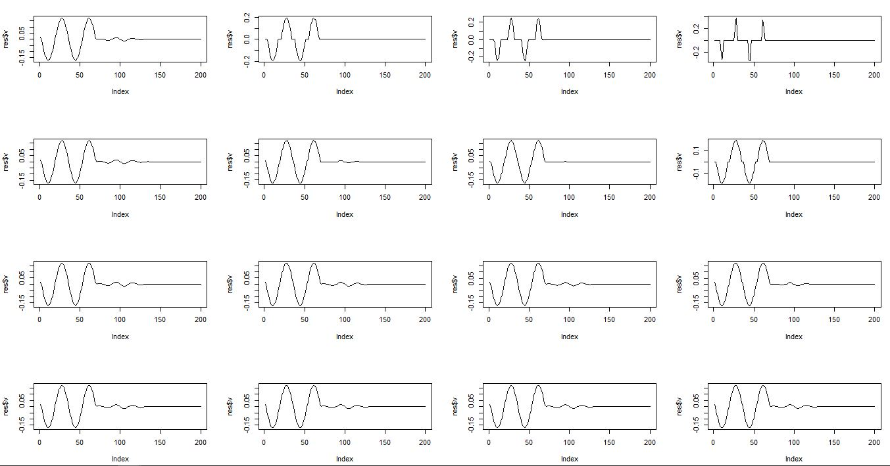

# MoMA
Solution to test problem
https://github.com/rstats-gsoc/gsoc2018/wiki/MoMA%3A-Modern-Multivariate-Analysis-in-R

-Implement the SFPCA algorithm for a rank-one approximation in C++ for the special case of L1 ("lasso") penalization on both the left and right singular vectors and user defined smoothing matrices; (see [40] for details of the algorithm) __FINISHED!__

-Wrap their implementation using Rcpp; __FINISHED__

-Test their implementation using testthat; __TODO__

-Package their implementation and pass R CMD check on at least two of the three major platforms: Windows, MacOS, and Linux (Debian/Ubuntu). __TODO__

# 1 Introduction
The follow code implement the Rank-one SFPCA in _Sparse and FUnctional Principal Compoments Analysis, Genevera I. Allen, 2013_. The challenge of proposing SFPCA lies in that 1) the model needs to take into account sparsity and smoothness of the principal components (PC), and 2) the optimiazation porblem should enjoy appropriate numerical property. In SFPCA algorithm, the original problem is divided into iterating solving penalized regression problem, which can be solved using proximal gradient methods or accelerated proximal gradient method.

# 2 Testing 

## 2.1 Dataset discription

```r
library('Rcpp')
library('RcppArmadillo')
setwd('C:/Users/Smart/Desktop')
sourceCpp('sfpca.cpp')
```
```r
# Some util functions
norm_vec <- function(x) sqrt(sum(x^2))

SSD <- function(n){
  # --------------------
  #  Generate squared second difference matrix, which looks like
  #   6   -4  1   0   0   0
  #   -4  6  -4   1   0   0
  #   1   -4  6   -4  1   0
  #   0   1   -4  6   -4  1
  #   ..
  #   I derived the formula and should be further verified
  #--------------------
  a <- 6*diag(n)
  for(i in 1:n){
    for(j in 1:n){
      if(abs(i-j) == 1) a[i,j] = -4;
      if(abs(i-j) == 2) a[i,j] = 1;
    }
  }
  return(a);
}

uni <- function(n){
  # Noramlize a vector
  u_1 <- as.vector(rnorm(n)) 
  return(u_1/norm_vec(u_1))
}
```


```r
# Create data, the same setting as section 5.1 Simulation Study in the paper
n <- 200
ind <- as.vector(seq(n))
u_1 <- uni(n)
u_2 <- uni(n)
u_3 <- uni(n)
eps <- matrix(rnorm(n*n),n,n)
eps <- eps/20
O_u <- SSD(n)
O_v <- O_u 
# Sinusoidal
v_1 <- sin((ind+15)*pi/17);v_1[floor(7/20*n):n]=0;v_1 <- v_1/norm_vec(v_1);

# Gaussian-modulated sinusoidal
v_2 <- as.vector(exp(-(ind-100)^2/650)*sin((ind-100)*2*pi/21)); 
v_2[0:floor(7/20*n)]=0;
v_2[floor(130/200*n):n] = 0;
v_2 <- v_2/norm_vec(v_2);

# Sinusoidal, not used in current testing
#v_3 <- sin((ind-40)*pi/30);v_3[0:floor(130/200*n)]=0;v_3 <- v_3/norm_vec(v_3);
#lines(v_3,col='red')

X <-  n/4*u_1 %*% t(v_1) + n/5*u_2 %*% t(v_2) +eps
print(norm(X) /norm(eps))
```

## 2.2 The effect of penalty parameters
```r
sm_set = c(0.1,1,10)
sp_set = c(1,3,5,7)
par(mfrow=c(length(sm_set),length(sp_set)))
for(sm in sm_set){
  for(sp in sp_set){
    res <- sfpca(X,
                  O_u,O_v,
                  sm,sm,
                  lambda_u=sp,lambda_v=sp,
                  "l1","l1",
                  1e-9,1e+5)
    plot(res$v,type='l',xlab='',ylab='')  
  }
}
mtext("Sparsity ->", side = 3, line = -32, outer = TRUE)
```

From top to bottom, we can see the connecting part become more smooth and round, because smooth penalty is becoming more significant. From left to right, remaining signal from $v2$ weakens, meanwhile the major part of $v1$ is also distorted.

## 2.3 Signal recovering
The part try to re-implement Section 5.1 in the paper _Sparse and FUnctional Principal Compoments Analysis, Gevenvera et al., 2013_. The major idea is that, $X = d_1u_1v_1^T + d_2u_2v_2^T + \epsilon$, where $v_1$ and $v_2$ are sinuoidal data, and we try to recover them from the noised matrix.

```r
# Run the model
# Input:
# ---- X: data matrix
# ---- O_u, O_v: Squared second difference matrix
# ---- lambda_u and lambda_v control the penalty level
# ---- "l1", "l1": proximal operator has closed form solution of L1.
# Output:
# ---- u,v: the PCs
# ---- d: u^T X v
# ---- Xhat: deflated X
res1 <- sfpca(X,
              O_u,O_v,
              0.1,0.1,
              lambda_u=5,lambda_v=5,
              "l1","l1",
              1e-9,1e+5)
res2 <- sfpca(res1$DeflatedX,
              O_u,O_v,
              1,1,
              lambda_u=6.5,lambda_v=6.5,
              "l1","l1",
              1e-9,1e+5)
par(mfrow=c(1,3))
# Original signal
plot(v_1,type = 'l',ylim=c(-0.3,0.3));
lines(v_2,col='blue',title="Original Signal");
# SFPCA PCs
plot(res1$v,type='l')  
lines(-res2$v,type='l',col="red",title="SFPCA")  
# SVD PCs
res <- svd(X)
plot(res$v[,1],type="l")
lines(res$v[,2],type="l",col="red",title="SVD")
```


We compare the result from simple SVD method. Frome left to top: Original signal, SFPCA, SVD. SFPCA is significantly better than SVD in selecting principal components when the original constituent signals are inherently sparse and smooth.


# 3 TODO List
### 3.0 Make it a package and pass platform testing.
### 3.1 Further test the degenerated cases, i.e., when $\alpha_u,\alpha_v,\Omega_u,\Omega_v$ are zeros.
### 3.2 C code commenting.Vecterization and optimization.

